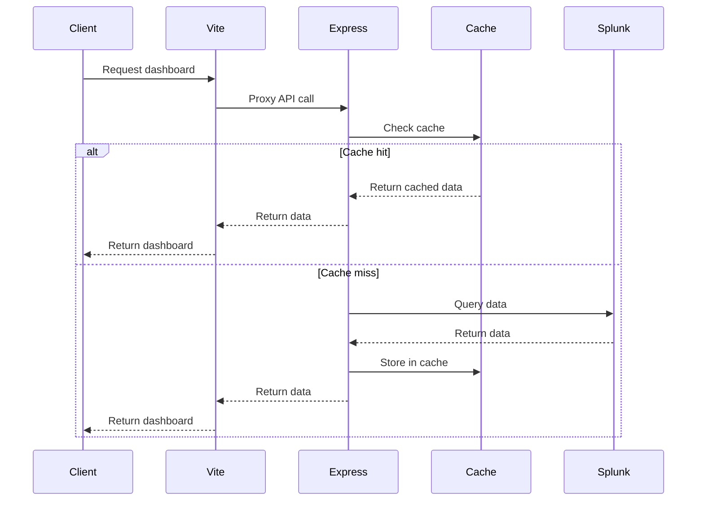

# Technical Architecture Documentation

## Table of Contents

1. [System Architecture](#system-architecture)
2. [Caching System Deep Dive](#caching-system-deep-dive)
3. [Data Flow](#data-flow)
4. [Performance Characteristics](#performance-characteristics)
5. [Security Implementation](#security-implementation)
6. [Error Handling](#error-handling)
7. [Monitoring & Observability](#monitoring--observability)

## System Architecture

### High-Level Architecture

```
┌─────────────────────────────────────────────────────────────────┐
│                        Client Layer                            │
│  ┌─────────────┐  ┌─────────────┐  ┌─────────────────────────┐ │
│  │   Browser   │  │   Mobile    │  │      Desktop App        │ │
│  │   (React)   │  │   (React)   │  │      (Electron)         │ │
│  └─────────────┘  └─────────────┘  └─────────────────────────┘ │
└─────────────────────────────────────────────────────────────────┘
                                │
                                ▼
┌─────────────────────────────────────────────────────────────────┐
│                     Load Balancer                              │
│                    (Nginx/HAProxy)                             │
└─────────────────────────────────────────────────────────────────┘
                                │
                                ▼
┌─────────────────────────────────────────────────────────────────┐
│                    Frontend Layer                              │
│  ┌─────────────────────────────────────────────────────────────┐ │
│  │                    Vite Dev Server                         │ │
│  │                     Port 5173                              │ │
│  │              (Hot Reload + API Proxy)                      │ │
│  └─────────────────────────────────────────────────────────────┘ │
└─────────────────────────────────────────────────────────────────┘
                                │
                                ▼
┌─────────────────────────────────────────────────────────────────┐
│                     Backend Layer                              │
│  ┌─────────────────────────────────────────────────────────────┐ │
│  │                    Express Server                          │ │
│  │                     Port 3000                              │ │
│  │              (API + Business Logic)                        │ │
│  └─────────────────────────────────────────────────────────────┘ │
└─────────────────────────────────────────────────────────────────┘
                                │
                                ▼
┌─────────────────────────────────────────────────────────────────┐
│                    Data Layer                                  │
│  ┌─────────────┐  ┌─────────────┐  ┌─────────────────────────┐ │
│  │   Splunk    │  │   Cache     │  │      File System        │ │
│  │ Enterprise  │  │   Store     │  │   (Dashboard Defs)      │ │
│  └─────────────┘  └─────────────┘  └─────────────────────────┘ │
└─────────────────────────────────────────────────────────────────┘
```

### Component Interaction Flow



## Caching System Deep Dive

### Cache Architecture

The caching system is built around a multi-tier approach with intelligent eviction strategies and performance optimization.

#### 1. Cache Store Implementation

```javascript
class CacheStore {
  constructor(options = {}) {
    this.store = new Map();
    this.maxSize = options.maxSize || 10000;
    this.defaultTTL = options.defaultTTL || 300000; // 5 minutes
    this.cleanupInterval = options.cleanupInterval || 300000; // 5 minutes
    this.stats = {
      hits: 0,
      misses: 0,
      evictions: 0,
      totalRequests: 0
    };
    
    this.startCleanup();
  }
  
  set(key, value, ttl = this.defaultTTL) {
    // Implement LRU eviction if cache is full
    if (this.store.size >= this.maxSize) {
      this.evictLRU();
    }
    
    const entry = {
      data: value,
      timestamp: Date.now(),
      ttl: ttl,
      hits: 0,
      lastAccessed: Date.now(),
      size: this.calculateSize(value)
    };
    
    this.store.set(key, entry);
    return entry;
  }
  
  get(key) {
    const entry = this.store.get(key);
    if (!entry) {
      this.stats.misses++;
      this.stats.totalRequests++;
      return null;
    }
    
    // Check if entry has expired
    if (Date.now() - entry.timestamp > entry.ttl) {
      this.store.delete(key);
      this.stats.misses++;
      this.stats.totalRequests++;
      return null;
    }
    
    // Update access statistics
    entry.hits++;
    entry.lastAccessed = Date.now();
    this.stats.hits++;
    this.stats.totalRequests++;
    
    return entry.data;
  }
  
  evictLRU() {
    let oldestKey = null;
    let oldestTime = Date.now();
    
    for (const [key, entry] of this.store.entries()) {
      if (entry.lastAccessed < oldestTime) {
        oldestTime = entry.lastAccessed;
        oldestKey = key;
      }
    }
    
    if (oldestKey) {
      this.store.delete(oldestKey);
      this.stats.evictions++;
    }
  }
  
  startCleanup() {
    setInterval(() => {
      const now = Date.now();
      let cleaned = 0;
      
      for (const [key, entry] of this.store.entries()) {
        if (now - entry.timestamp > entry.ttl) {
          this.store.delete(key);
          cleaned++;
        }
      }
      
      if (cleaned > 0) {
        console.log(`Cache cleanup: removed ${cleaned} expired entries`);
      }
    }, this.cleanupInterval);
  }
  
  getStats() {
    const totalEntries = this.store.size;
    const memoryUsage = this.calculateTotalMemory();
    const hitRate = this.stats.totalRequests > 0 ? 
      this.stats.hits / this.stats.totalRequests : 0;
    
    return {
      totalEntries,
      memoryUsage,
      hitRate: hitRate.toFixed(4),
      missRate: (1 - hitRate).toFixed(4),
      hits: this.stats.hits,
      misses: this.stats.misses,
      evictions: this.stats.evictions,
      totalRequests: this.stats.totalRequests,
      lastCleanup: new Date().toISOString()
    };
  }
  
  calculateSize(value) {
    // Rough estimation of memory usage
    return JSON.stringify(value).length * 2; // UTF-16 characters
  }
  
  calculateTotalMemory() {
    let totalSize = 0;
    for (const entry of this.store.values()) {
      totalSize += entry.size;
    }
    
    // Convert to human-readable format
    if (totalSize < 1024) return `${totalSize} B`;
    if (totalSize < 1024 * 1024) return `${(totalSize / 1024).toFixed(2)} KB`;
    if (totalSize < 1024 * 1024 * 1024) return `${(totalSize / (1024 * 1024)).toFixed(2)} MB`;
    return `${(totalSize / (1024 * 1024 * 1024)).toFixed(2)} GB`;
  }
}
```

#### 2. Cache Key Strategy

```javascript
class CacheKeyGenerator {
  static generateDatasourceKey(dsid, params = {}) {
    const sortedParams = Object.keys(params)
      .sort()
      .reduce((result, key) => {
        result[key] = params[key];
        return result;
      }, {});
    
    return `datasource:${dsid}:${JSON.stringify(sortedParams)}`;
  }
  
  static generateDashboardKey(dashboardId, version = '1.0') {
    return `dashboard:${dashboardId}:${version}`;
  }
  
  static generateSearchKey(query, timeRange, app) {
    const normalizedQuery = query.trim().toLowerCase();
    const timeHash = this.hashTimeRange(timeRange);
    return `search:${normalizedQuery}:${timeHash}:${app}`;
  }
  
  static hashTimeRange(timeRange) {
    // Create a hash of the time range for consistent caching
    const timeStr = `${timeRange.earliest}-${timeRange.latest}`;
    return require('crypto').createHash('md5').update(timeStr).digest('hex').substring(0, 8);
  }
}
```

#### 3. TTL Strategy Implementation

```javascript
class TTLStrategy {
  static getTTL(dataType, options = {}) {
    const baseTTLs = {
      'datasource': 300000,      // 5 minutes
      'dashboard': 3600000,      // 1 hour
      'saved_search': 1800000,   // 30 minutes
      'user_preference': 86400000, // 24 hours
      'splunk_config': 7200000,  // 2 hours
      'visualization': 1800000   // 30 minutes
    };
    
    let ttl = baseTTLs[dataType] || 300000;
    
    // Adjust TTL based on data volatility
    if (options.isRealTime) {
      ttl = Math.min(ttl, 30000); // Max 30 seconds for real-time data
    }
    
    if (options.isHistorical) {
      ttl = Math.max(ttl, 1800000); // Min 30 minutes for historical data
    }
    
    if (options.refreshInterval) {
      ttl = Math.max(ttl, options.refreshInterval * 1000);
    }
    
    return ttl;
  }
  
  static shouldRefresh(entry, dataType, options = {}) {
    const now = Date.now();
    const age = now - entry.timestamp;
    const ttl = entry.ttl;
    
    // Force refresh if expired
    if (age > ttl) return true;
    
    // Refresh if approaching expiration (within 10% of TTL)
    if (age > ttl * 0.9) return true;
    
    // Refresh based on data type specific rules
    switch (dataType) {
      case 'datasource':
        return this.shouldRefreshDatasource(entry, options);
      case 'dashboard':
        return this.shouldRefreshDashboard(entry, options);
      default:
        return false;
    }
  }
  
  static shouldRefreshDatasource(entry, options) {
    // Refresh if query parameters changed
    if (options.queryChanged) return true;
    
    // Refresh if time range is recent (within last hour)
    const now = Date.now();
    const oneHourAgo = now - 3600000;
    if (entry.timestamp > oneHourAgo) return true;
    
    return false;
  }
  
  static shouldRefreshDashboard(entry, options) {
    // Refresh if dashboard definition changed
    if (options.definitionChanged) return true;
    
    // Refresh if any datasource was refreshed
    if (options.datasourceRefreshed) return true;
    
    return false;
  }
}
```

#### 4. Cache Warming Strategy

```javascript
class CacheWarmer {
  constructor(cache, datasourceService) {
    this.cache = cache;
    this.datasourceService = datasourceService;
    this.warmingQueue = new Set();
  }
  
  async warmCache(dashboardId) {
    try {
      const dashboard = await this.getDashboardDefinition(dashboardId);
      const datasources = this.extractDatasources(dashboard);
      
      // Warm up all datasources in parallel
      const warmPromises = datasources.map(ds => this.warmDatasource(ds));
      await Promise.allSettled(warmPromises);
      
      console.log(`Cache warming completed for dashboard: ${dashboardId}`);
    } catch (error) {
      console.error(`Cache warming failed for dashboard: ${dashboardId}`, error);
    }
  }
  
  async warmDatasource(datasource) {
    if (this.warmingQueue.has(datasource.id)) {
      return; // Already warming
    }
    
    this.warmingQueue.add(datasource.id);
    
    try {
      const data = await this.datasourceService.query(datasource);
      const key = CacheKeyGenerator.generateDatasourceKey(datasource.id);
      const ttl = TTLStrategy.getTTL('datasource', datasource);
      
      this.cache.set(key, data, ttl);
      console.log(`Warmed cache for datasource: ${datasource.id}`);
    } catch (error) {
      console.error(`Failed to warm cache for datasource: ${datasource.id}`, error);
    } finally {
      this.warmingQueue.delete(datasource.id);
    }
  }
  
  extractDatasources(dashboard) {
    const datasources = [];
    
    if (dashboard.dataSources) {
      Object.entries(dashboard.dataSources).forEach(([id, config]) => {
        datasources.push({ id, ...config });
      });
    }
    
    return datasources;
  }
}
```

### Cache Performance Metrics

#### 1. Hit Rate Analysis

```javascript
class CacheAnalytics {
  constructor(cache) {
    this.cache = cache;
    this.metrics = {
      hourly: new Map(),
      daily: new Map(),
      datasourcePerformance: new Map(),
      userBehavior: new Map()
    };
  }
  
  recordRequest(key, hit, responseTime, userId = null) {
    const now = new Date();
    const hourKey = this.getHourKey(now);
    const dayKey = this.getDayKey(now);
    
    // Record hourly metrics
    if (!this.metrics.hourly.has(hourKey)) {
      this.metrics.hourly.set(hourKey, { hits: 0, misses: 0, totalTime: 0, requests: 0 });
    }
    
    const hourMetrics = this.metrics.hourly.get(hourKey);
    hourMetrics.requests++;
    hourMetrics.totalTime += responseTime;
    
    if (hit) {
      hourMetrics.hits++;
    } else {
      hourMetrics.misses++;
    }
    
    // Record daily metrics
    if (!this.metrics.daily.has(dayKey)) {
      this.metrics.daily.set(dayKey, { hits: 0, misses: 0, totalTime: 0, requests: 0 });
    }
    
    const dayMetrics = this.metrics.daily.get(dayKey);
    dayMetrics.requests++;
    dayMetrics.totalTime += responseTime;
    
    if (hit) {
      dayMetrics.hits++;
    } else {
      dayMetrics.misses++;
    }
    
    // Record datasource performance
    const datasourceId = this.extractDatasourceId(key);
    if (datasourceId) {
      if (!this.metrics.datasourcePerformance.has(datasourceId)) {
        this.metrics.datasourcePerformance.set(datasourceId, {
          hits: 0, misses: 0, totalTime: 0, requests: 0
        });
      }
      
      const dsMetrics = this.metrics.datasourcePerformance.get(datasourceId);
      dsMetrics.requests++;
      dsMetrics.totalTime += responseTime;
      
      if (hit) {
        dsMetrics.hits++;
      } else {
        dsMetrics.misses++;
      }
    }
    
    // Record user behavior
    if (userId) {
      if (!this.metrics.userBehavior.has(userId)) {
        this.metrics.userBehavior.set(userId, {
          hits: 0, misses: 0, totalTime: 0, requests: 0,
          lastAccess: now, favoriteDashboards: new Set()
        });
      }
      
      const userMetrics = this.metrics.userBehavior.get(userId);
      userMetrics.requests++;
      userMetrics.totalTime += responseTime;
      userMetrics.lastAccess = now;
      
      if (hit) {
        userMetrics.hits++;
      } else {
        userMetrics.misses++;
      }
    }
  }
  
  getHourKey(date) {
    return `${date.getFullYear()}-${String(date.getMonth() + 1).padStart(2, '0')}-${String(date.getDate()).padStart(2, '0')}T${String(date.getHours()).padStart(2, '0')}:00:00Z`;
  }
  
  getDayKey(date) {
    return `${date.getFullYear()}-${String(date.getMonth() + 1).padStart(2, '0')}-${String(date.getDate()).padStart(2, '0')}`;
  }
  
  extractDatasourceId(key) {
    const match = key.match(/^datasource:([^:]+):/);
    return match ? match[1] : null;
  }
  
  getPerformanceReport(timeRange = '24h') {
    const now = new Date();
    let startTime;
    
    switch (timeRange) {
      case '1h':
        startTime = new Date(now.getTime() - 3600000);
        break;
      case '24h':
        startTime = new Date(now.getTime() - 86400000);
        break;
      case '7d':
        startTime = new Date(now.getTime() - 604800000);
        break;
      case '30d':
        startTime = new Date(now.getTime() - 2592000000);
        break;
      default:
        startTime = new Date(now.getTime() - 86400000);
    }
    
    const report = {
      timeRange,
      period: { start: startTime.toISOString(), end: now.toISOString() },
      overall: { hits: 0, misses: 0, totalTime: 0, requests: 0 },
      hourly: [],
      topDatasources: [],
      topUsers: []
    };
    
    // Aggregate hourly metrics
    for (const [hourKey, metrics] of this.metrics.hourly.entries()) {
      const hourDate = new Date(hourKey);
      if (hourDate >= startTime && hourDate <= now) {
        report.overall.hits += metrics.hits;
        report.overall.misses += metrics.misses;
        report.overall.totalTime += metrics.totalTime;
        report.overall.requests += metrics.requests;
        
        report.hourly.push({
          hour: hourKey,
          ...metrics,
          hitRate: metrics.requests > 0 ? metrics.hits / metrics.requests : 0,
          avgResponseTime: metrics.requests > 0 ? metrics.totalTime / metrics.requests : 0
        });
      }
    }
    
    // Top datasources
    const datasourceStats = Array.from(this.metrics.datasourcePerformance.entries())
      .map(([id, metrics]) => ({
        id,
        ...metrics,
        hitRate: metrics.requests > 0 ? metrics.hits / metrics.requests : 0,
        avgResponseTime: metrics.requests > 0 ? metrics.totalTime / metrics.requests : 0
      }))
      .sort((a, b) => b.requests - a.requests)
      .slice(0, 10);
    
    report.topDatasources = datasourceStats;
    
    // Top users
    const userStats = Array.from(this.metrics.userBehavior.entries())
      .map(([id, metrics]) => ({
        id,
        ...metrics,
        hitRate: metrics.requests > 0 ? metrics.hits / metrics.requests : 0,
        avgResponseTime: metrics.requests > 0 ? metrics.totalTime / metrics.requests : 0,
        lastAccess: metrics.lastAccess.toISOString()
      }))
      .sort((a, b) => b.requests - a.requests)
      .slice(0, 10);
    
    report.topUsers = userStats;
    
    // Calculate overall metrics
    report.overall.hitRate = report.overall.requests > 0 ? 
      report.overall.hits / report.overall.requests : 0;
    report.overall.avgResponseTime = report.overall.requests > 0 ? 
      report.overall.totalTime / report.overall.requests : 0;
    
    return report;
  }
}
```

## Data Flow

### Request Processing Pipeline

```javascript
class RequestPipeline {
  constructor(cache, datasourceService, rateLimiter) {
    this.cache = cache;
    this.datasourceService = datasourceService;
    this.rateLimiter = rateLimiter;
    this.analytics = new CacheAnalytics(cache);
  }
  
  async processRequest(req, res, next) {
    const startTime = Date.now();
    const requestId = this.generateRequestId();
    
    try {
      // 1. Rate limiting
      await this.rateLimiter.checkLimit(req.ip);
      
      // 2. Authentication (if required)
      const user = await this.authenticateRequest(req);
      
      // 3. Cache lookup
      const cacheKey = this.generateCacheKey(req);
      let data = this.cache.get(cacheKey);
      let cacheHit = !!data;
      
      // 4. If cache miss, fetch from source
      if (!data) {
        data = await this.fetchData(req, user);
        
        // Store in cache
        const ttl = this.calculateTTL(req, data);
        this.cache.set(cacheKey, data, ttl);
      }
      
      // 5. Record metrics
      const responseTime = Date.now() - startTime;
      this.analytics.recordRequest(cacheKey, cacheHit, responseTime, user?.id);
      
      // 6. Send response
      res.json({
        success: true,
        data,
        cache: {
          hit: cacheHit,
          key: cacheKey,
          ttl: this.cache.getEntry(cacheKey)?.ttl
        },
        performance: {
          responseTime,
          requestId
        }
      });
      
    } catch (error) {
      // Error handling
      const responseTime = Date.now() - startTime;
      this.analytics.recordRequest(cacheKey, false, responseTime, user?.id);
      
      res.status(error.statusCode || 500).json({
        success: false,
        error: error.message,
        requestId,
        performance: { responseTime }
      });
    }
  }
  
  generateRequestId() {
    return `req_${Date.now()}_${Math.random().toString(36).substr(2, 9)}`;
  }
  
  generateCacheKey(req) {
    const { path, query, body } = req;
    return `${path}:${JSON.stringify(query)}:${JSON.stringify(body)}`;
  }
  
  calculateTTL(req, data) {
    // Determine TTL based on request type and data characteristics
    const dataType = this.getDataType(req);
    const options = this.getTTLOptions(req, data);
    return TTLStrategy.getTTL(dataType, options);
  }
  
  getDataType(req) {
    if (req.path.includes('/api/data/')) return 'datasource';
    if (req.path.includes('/api/dashboards/')) return 'dashboard';
    if (req.path.includes('/api/saved-searches/')) return 'saved_search';
    return 'generic';
  }
  
  getTTLOptions(req, data) {
    return {
      isRealTime: data?.isRealTime || false,
      isHistorical: data?.isHistorical || false,
      refreshInterval: data?.refreshInterval || null,
      queryChanged: req.query?.queryChanged || false
    };
  }
}
```

## Performance Characteristics

### Cache Performance Characteristics

**Note: Performance metrics are theoretical estimates. Actual performance depends on system configuration, data complexity, and usage patterns.**

The caching system is designed to provide:
- **Faster response times** for repeated requests
- **Reduced Splunk API calls** through result caching
- **Improved throughput** for cached data access
- **Memory overhead** proportional to cache size and TTL settings

**For accurate performance metrics, implement load testing and monitoring in your specific environment.**

### Memory Usage Patterns

**Note: The system uses basic Node.js memory monitoring. For advanced memory analysis, consider implementing dedicated monitoring tools.**

The current implementation provides:
- **Basic memory usage tracking** via `process.memoryUsage()`
- **Cache size monitoring** through the cache statistics API
- **Automatic cleanup** of expired cache entries

**For production monitoring, implement:**
- **Prometheus metrics** for memory usage
- **Grafana dashboards** for visualization
- **Alerting** for memory thresholds
- **Log aggregation** for memory-related events

## Security Implementation

### Rate Limiting Strategy

```javascript
class AdvancedRateLimiter {
  constructor(options = {}) {
    this.windows = new Map();
    this.maxRequests = options.maxRequests || 100;
    this.windowMs = options.windowMs || 15 * 60 * 1000; // 15 minutes
    this.blockDuration = options.blockDuration || 60 * 60 * 1000; // 1 hour
    this.blockedIPs = new Map();
  }
  
  async checkLimit(ip) {
    const now = Date.now();
    
    // Check if IP is blocked
    if (this.blockedIPs.has(ip)) {
      const blockInfo = this.blockedIPs.get(ip);
      if (now < blockInfo.until) {
        throw new Error(`IP ${ip} is blocked until ${new Date(blockInfo.until).toISOString()}`);
      } else {
        this.blockedIPs.delete(ip);
      }
    }
    
    // Get or create window for this IP
    if (!this.windows.has(ip)) {
      this.windows.set(ip, {
        requests: [],
        lastReset: now
      });
    }
    
    const window = this.windows.get(ip);
    
    // Reset window if needed
    if (now - window.lastReset > this.windowMs) {
      window.requests = [];
      window.lastReset = now;
    }
    
    // Check if limit exceeded
    if (window.requests.length >= this.maxRequests) {
      // Block IP for blockDuration
      this.blockedIPs.set(ip, {
        until: now + this.blockDuration,
        reason: 'Rate limit exceeded'
      });
      
      throw new Error(`Rate limit exceeded for IP ${ip}`);
    }
    
    // Add current request
    window.requests.push(now);
    
    // Clean up old requests
    window.requests = window.requests.filter(time => now - time < this.windowMs);
    
    return {
      remaining: this.maxRequests - window.requests.length,
      resetTime: window.lastReset + this.windowMs
    };
  }
  
  getStats() {
    const stats = {
      totalWindows: this.windows.size,
      blockedIPs: this.blockedIPs.size,
      blockedIPList: Array.from(this.blockedIPs.entries()).map(([ip, info]) => ({
        ip,
        blockedUntil: new Date(info.until).toISOString(),
        reason: info.reason
      }))
    };
    
    return stats;
  }
}
```

## Error Handling

### Comprehensive Error Handling

```javascript
class ErrorHandler {
  constructor(logger) {
    this.logger = logger;
    this.errorCounts = new Map();
    this.errorThresholds = {
      'SplunkConnectionError': 5,
      'CacheError': 3,
      'ValidationError': 10,
      'RateLimitError': 20
    };
  }
  
  handleError(error, req, context = {}) {
    // Log error with context
    this.logger.error('Error occurred', {
      error: error.message,
      stack: error.stack,
      context,
      request: {
        method: req.method,
        path: req.path,
        ip: req.ip,
        userAgent: req.get('User-Agent')
      },
      timestamp: new Date().toISOString()
    });
    
    // Track error counts
    const errorType = this.getErrorType(error);
    this.incrementErrorCount(errorType);
    
    // Check if we need to take action
    this.checkErrorThreshold(errorType, context);
    
    // Return appropriate error response
    return this.formatErrorResponse(error, context);
  }
  
  getErrorType(error) {
    if (error.code === 'ECONNREFUSED') return 'SplunkConnectionError';
    if (error.message.includes('cache')) return 'CacheError';
    if (error.message.includes('validation')) return 'ValidationError';
    if (error.message.includes('rate limit')) return 'RateLimitError';
    return 'GenericError';
  }
  
  incrementErrorCount(errorType) {
    const current = this.errorCounts.get(errorType) || 0;
    this.errorCounts.set(errorType, current + 1);
  }
  
  checkErrorThreshold(errorType, context) {
    const threshold = this.errorThresholds[errorType];
    const count = this.errorCounts.get(errorType) || 0;
    
    if (count >= threshold) {
      this.logger.warn(`Error threshold exceeded for ${errorType}`, {
        count,
        threshold,
        context
      });
      
      // Take action based on error type
      switch (errorType) {
        case 'SplunkConnectionError':
          this.handleSplunkConnectionIssue(context);
          break;
        case 'CacheError':
          this.handleCacheIssue(context);
          break;
        case 'RateLimitError':
          this.handleRateLimitIssue(context);
          break;
      }
    }
  }
  
  handleSplunkConnectionIssue(context) {
    // Implement circuit breaker pattern
    this.logger.error('Splunk connection issues detected, implementing circuit breaker');
    // Set circuit breaker state
  }
  
  handleCacheIssue(context) {
    // Clear problematic cache entries
    this.logger.warn('Cache issues detected, clearing problematic entries');
    // Implement cache recovery logic
  }
  
  handleRateLimitIssue(context) {
    // Adjust rate limiting parameters
    this.logger.warn('Rate limit issues detected, adjusting parameters');
    // Implement adaptive rate limiting
  }
  
  formatErrorResponse(error, context) {
    const errorResponse = {
      success: false,
      error: {
        message: error.message,
        type: this.getErrorType(error),
        code: error.code || 'UNKNOWN_ERROR',
        timestamp: new Date().toISOString()
      }
    };
    
    // Add context in development mode
    if (process.env.NODE_ENV === 'development') {
      errorResponse.error.stack = error.stack;
      errorResponse.error.context = context;
    }
    
    return errorResponse;
  }
  
  getErrorStats() {
    const stats = {};
    for (const [errorType, count] of this.errorCounts.entries()) {
      stats[errorType] = {
        count,
        threshold: this.errorThresholds[errorType] || 'N/A',
        exceeded: count >= (this.errorThresholds[errorType] || Infinity)
      };
    }
    
    return stats;
  }
}
```

## Monitoring & Observability

### Health Check System

```javascript
class HealthChecker {
  constructor(services) {
    this.services = services;
    this.healthStatus = {
      status: 'healthy',
      timestamp: new Date().toISOString(),
      checks: new Map(),
      lastCheck: null
    };
  }
  
  async performHealthCheck() {
    const startTime = Date.now();
    const checks = new Map();
    
    try {
      // Check Splunk connection
      const splunkHealth = await this.checkSplunkHealth();
      checks.set('splunk', splunkHealth);
      
      // Check cache health
      const cacheHealth = await this.checkCacheHealth();
      checks.set('cache', cacheHealth);
      
      // Check database health (if applicable)
      const dbHealth = await this.checkDatabaseHealth();
      checks.set('database', dbHealth);
      
      // Check memory usage
      const memoryHealth = await this.checkMemoryHealth();
      checks.set('memory', memoryHealth);
      
      // Determine overall status
      const overallStatus = this.determineOverallStatus(checks);
      
      this.healthStatus = {
        status: overallStatus,
        timestamp: new Date().toISOString(),
        checks: checks,
        lastCheck: new Date().toISOString(),
        responseTime: Date.now() - startTime
      };
      
      return this.healthStatus;
      
    } catch (error) {
      this.healthStatus = {
        status: 'unhealthy',
        timestamp: new Date().toISOString(),
        checks: checks,
        lastCheck: new Date().toISOString(),
        error: error.message
      };
      
      throw error;
    }
  }
  
  async checkSplunkHealth() {
    try {
      const startTime = Date.now();
      const response = await this.services.splunk.testConnection();
      const responseTime = Date.now() - startTime;
      
      return {
        status: 'healthy',
        responseTime,
        details: response,
        timestamp: new Date().toISOString()
      };
    } catch (error) {
      return {
        status: 'unhealthy',
        error: error.message,
        timestamp: new Date().toISOString()
      };
    }
  }
  
  async checkCacheHealth() {
    try {
      const cacheStats = this.services.cache.getStats();
      const memoryUsage = process.memoryUsage();
      
      // Check if cache is using reasonable amount of memory
      const memoryThreshold = 500 * 1024 * 1024; // 500MB
      const memoryStatus = memoryUsage.heapUsed < memoryThreshold ? 'healthy' : 'warning';
      
      return {
        status: memoryStatus,
        details: {
          totalEntries: cacheStats.totalEntries,
          memoryUsage: cacheStats.memoryUsage,
          hitRate: cacheStats.hitRate,
          memoryThreshold: `${(memoryThreshold / (1024 * 1024)).toFixed(2)} MB`
        },
        timestamp: new Date().toISOString()
      };
    } catch (error) {
      return {
        status: 'unhealthy',
        error: error.message,
        timestamp: new Date().toISOString()
      };
    }
  }
  
  async checkMemoryHealth() {
    const memoryUsage = process.memoryUsage();
    const maxMemory = 1024 * 1024 * 1024; // 1GB
    const memoryPercentage = (memoryUsage.heapUsed / maxMemory) * 100;
    
    let status = 'healthy';
    if (memoryPercentage > 80) status = 'warning';
    if (memoryPercentage > 95) status = 'critical';
    
    return {
      status,
      details: {
        heapUsed: `${(memoryUsage.heapUsed / (1024 * 1024)).toFixed(2)} MB`,
        heapTotal: `${(memoryUsage.heapTotal / (1024 * 1024)).toFixed(2)} MB`,
        external: `${(memoryUsage.external / (1024 * 1024)).toFixed(2)} MB`,
        percentage: `${memoryPercentage.toFixed(2)}%`
      },
      timestamp: new Date().toISOString()
    };
  }
  
  determineOverallStatus(checks) {
    const statuses = Array.from(checks.values()).map(check => check.status);
    
    if (statuses.includes('critical')) return 'critical';
    if (statuses.includes('unhealthy')) return 'unhealthy';
    if (statuses.includes('warning')) return 'warning';
    return 'healthy';
  }
  
  getHealthStatus() {
    return this.healthStatus;
  }
  
  async startPeriodicHealthChecks(intervalMs = 30000) {
    setInterval(async () => {
      try {
        await this.performHealthCheck();
      } catch (error) {
        console.error('Periodic health check failed:', error);
      }
    }, intervalMs);
  }
}
```

This technical architecture document provides a comprehensive understanding of the system's implementation details, particularly focusing on the sophisticated caching system that provides significant performance improvements while maintaining data freshness and system reliability.
